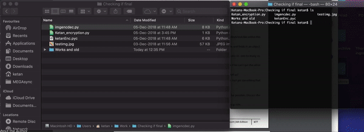
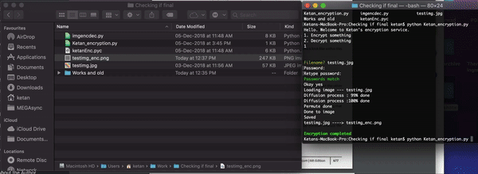

# Image Encrypt and Decrypt
This project shows some work on how we can encrypt and decrypt images without changing the jpg/png file signatures. The few softwares I tried earlier were changing the file header so when someone else tried opening it with a photo viewer it would show as a corrupt file and they may in-turn delete the encrypted image. 
In this method the photo viewer opens the file preventing it from unwanted deletions on account of "corrupt file" but the encrypted image is not legible to understand it's contents.

## Demo
### Encryption
This is a gif of the encryption command  

### Decryption
This is a gif of the decryption command  

### As we can see the decrypted and original image are visually the same.

If the wrong password is supplied the decrypted image is still not legible.  

